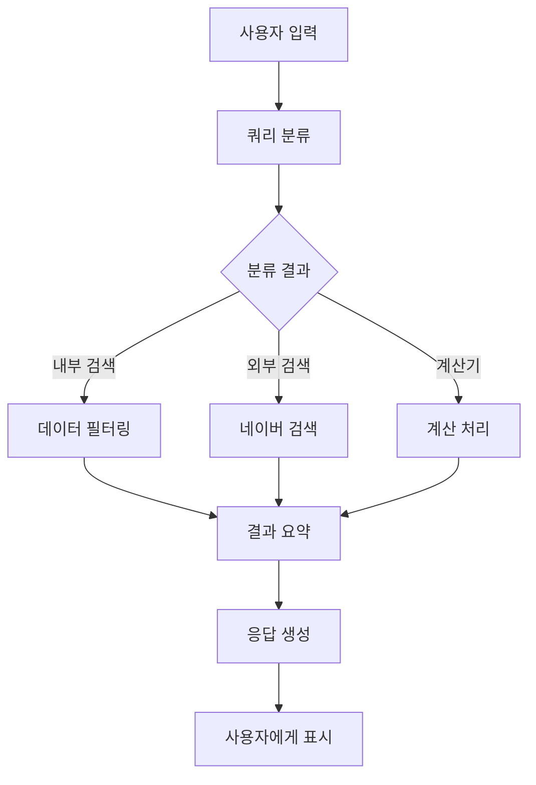

# 지역화폐 검색 시스템 기술 문서

## 목차
1. [시스템 아키텍처](#1-시스템-아키텍처)
2. [작동 프로세스](#2-작동-프로세스)
3. [주요 기능 상세](#3-주요-기능-상세)
4. [데이터 구조](#4-데이터-구조)
5. [성능 최적화](#5-성능-최적화)
6. [확장성](#6-확장성)
7. [테스트 방법](#7-테스트-방법)
8. [유지보수](#8-유지보수)

## 1. 시스템 아키텍처

### 1.1 전체 구조
```
[사용자 인터페이스 (Streamlit)]
        ↓
[에이전트 시스템 (LangChain)]
        ↓
[도구 모음 (Tools)]
        ↓
[데이터베이스/외부 API]
```

### 1.2 주요 컴포넌트

#### 1.2.1 프론트엔드 (app.py)
```python
import streamlit as st
from agents.agent_executor import agent_executor
from langchain_core.messages import AIMessage, HumanMessage
from dotenv import load_dotenv

load_dotenv()

st.set_page_config(page_title="지역사랑상품권 챗봇", layout="wide")
st.title("💬 지역사랑상품권 멀티턴 챗봇")

# 세션 상태로 멀티턴 대화 유지
if "chat_history" not in st.session_state:
    st.session_state.chat_history = []

# 사용자 입력 받기
user_input = st.chat_input("무엇이 궁금한가요? 예: '모바일 되는 충청도 지역상품권 알려줘'")

if user_input:
    # 대화 기록 저장
    st.session_state.chat_history.append(HumanMessage(content=user_input))
    
    # Agent 실행
    with st.spinner("🤖 답변 생성 중..."):
        response = agent_executor.invoke({
            "input": user_input,
            "chat_history": st.session_state.chat_history
        })

    # 응답 저장
    st.session_state.chat_history.append(AIMessage(content=response["output"]))
```

#### 1.2.2 에이전트 시스템 (agent_executor.py)
```python
import os
from typing import TypedDict, List
from langchain_core.tools import tool
from langchain_core.runnables import Runnable
from langchain_core.prompts import ChatPromptTemplate, MessagesPlaceholder
from langchain_core.messages import SystemMessage
from langchain.agents import AgentExecutor, create_openai_functions_agent
from langchain.memory import ConversationBufferMemory
from langchain_openai import ChatOpenAI

# LLM 설정
llm = ChatOpenAI(
    model="gpt-4o",
    temperature=0,
    api_key=OPENAI_API_KEY
)

# 도구 정의
@tool
def filter_coupon_data(query: str) -> List[dict]:
    """질문에서 조건을 추출하고, JSONL 데이터를 조건에 맞게 필터링합니다."""
    cond = parse_conditions(query)
    data = load_jsonl("data/지역사랑상품권_긍정_부정전처리_cleaned.jsonl")
    results = filter_jsonl_by_condition(data, cond)
    return results[:30]

# 도구 목록
tools = [
    filter_coupon_data,
    summarize_coupon_results,
    naver_local_search,
    naver_search  
]

# 메모리 설정
memory = ConversationBufferMemory(
    memory_key="chat_history",
    return_messages=True
)

# Agent 구성
prompt = ChatPromptTemplate.from_messages([
    SystemMessage(content="당신은 지역사랑상품권에 대해 질문을 분석하고 도구를 사용해 응답하는 AI입니다."),
    MessagesPlaceholder(variable_name="chat_history"),
    ("human", "{input}"),
    MessagesPlaceholder(variable_name="agent_scratchpad")
])

agent = create_openai_functions_agent(
    llm=llm,
    tools=tools,
    prompt=prompt
)

# AgentExecutor 생성
agent_executor = AgentExecutor(
    agent=agent,
    tools=tools,
    memory=memory,
    verbose=True
)
```

## 2. 작동 프로세스

### 2.1 기본 흐름도


### 2.2 쿼리 분류 (query_classifier.py)
```python
from typing import TypedDict
from langchain_openai import ChatOpenAI

class QueryClassification(TypedDict):
    query_type: str  # "internal_search", "external_search", "calculator"
    confidence: float

def classify_query(query: str) -> QueryClassification:
    """사용자 쿼리를 분류하여 적절한 처리 방식을 결정합니다."""
    llm = ChatOpenAI(temperature=0)
    
    prompt = f"""
    다음 질문을 분석하여 처리 방식을 결정해주세요:
    질문: {query}
    
    가능한 처리 방식:
    1. internal_search: 지역화폐 데이터베이스 내 검색
    2. external_search: 외부 웹 검색 필요
    3. calculator: 계산기 기능 필요
    
    JSON 형식으로 응답:
    {{
        "query_type": "처리방식",
        "confidence": 0.0-1.0
    }}
    """
    
    response = llm.invoke(prompt)
    return eval(response.content)
```

## 3. 주요 기능 상세

### 3.1 데이터 필터링 (filter_tool.py)
```python
from typing import List, Dict
import json

def parse_conditions(query: str) -> Dict:
    """질문에서 검색 조건을 추출합니다."""
    conditions = {
        "region": None,
        "support_type": None,
        "keywords": []
    }
    # 조건 파싱 로직
    return conditions

def load_jsonl(file_path: str) -> List[Dict]:
    """JSONL 파일을 로드합니다."""
    data = []
    with open(file_path, 'r', encoding='utf-8') as f:
        for line in f:
            data.append(json.loads(line))
    return data

def filter_jsonl_by_condition(data: List[Dict], conditions: Dict) -> List[Dict]:
    """조건에 맞는 데이터를 필터링합니다."""
    filtered_data = []
    for item in data:
        if matches_conditions(item, conditions):
            filtered_data.append(item)
    return filtered_data
```

### 3.2 LLM 도구 (llm_tool.py)
```python
from typing import List, Dict
from langchain_openai import ChatOpenAI

def summarize_results(results: List[Dict]) -> str:
    """검색 결과를 요약합니다."""
    llm = ChatOpenAI(temperature=0)
    
    prompt = f"""
    다음 지역화폐 검색 결과를 요약해주세요:
    {results}
    
    다음 형식으로 요약:
    1. 총 검색 결과 수
    2. 주요 특징
    3. 사용 가능 지역
    4. 지원 방식
    """
    
    response = llm.invoke(prompt)
    return response.content
```

## 4. 데이터 구조

### 4.1 JSONL 데이터 형식
```json
{
  "content": "제주 제주시에서는 \"[제주특별자치도]탐나는전\"이 제공되며, 지류형, 모바일, 카드형은 지원되며.",
  "metadata": {
    "지역1": "제주",
    "지역2": "제주시", 
    "이름": "[제주특별자치도]탐나는전",
    "지원방식": ["지류형", "모바일", "카드형"],
    "비지원방식": [],
    "링크": "http://tamna.jeju.go.kr/mainView.do"
  }
}
```

## 5. 성능 최적화

### 5.1 캐싱 전략
```python
import streamlit as st
from functools import lru_cache

@st.cache_data
def load_data():
    """데이터 로딩 결과를 캐싱합니다."""
    return load_jsonl("data/지역사랑상품권_긍정_부정전처리_cleaned.jsonl")

@lru_cache(maxsize=100)
def search_cache(query: str, k: int = 5):
    """검색 결과를 캐싱합니다."""
    return vector_db.search(query, k=k)
```

## 6. 확장성

### 6.1 새로운 도구 추가 예시
```python
@tool
def new_custom_tool(query: str) -> str:
    """새로운 커스텀 도구를 추가합니다."""
    # 도구 로직 구현
    return "결과"
```

## 7. 테스트 방법

### 7.1 단위 테스트
```python
import unittest
from tools.filter_tool import parse_conditions, filter_jsonl_by_condition

class TestFilterTool(unittest.TestCase):
    def test_parse_conditions(self):
        query = "경기도 모바일 지역화폐"
        conditions = parse_conditions(query)
        self.assertEqual(conditions["region"], "경기도")
        self.assertEqual(conditions["support_type"], "모바일")

    def test_filter_jsonl(self):
        data = [{"metadata": {"지역1": "경기도", "지원방식": ["모바일"]}}]
        conditions = {"region": "경기도", "support_type": "모바일"}
        results = filter_jsonl_by_condition(data, conditions)
        self.assertEqual(len(results), 1)
```

## 8. 유지보수

### 8.1 로깅 설정
```python
import logging

logging.basicConfig(
    level=logging.INFO,
    format='%(asctime)s - %(name)s - %(levelname)s - %(message)s',
    handlers=[
        logging.FileHandler('app.log'),
        logging.StreamHandler()
    ]
)

logger = logging.getLogger(__name__)

def log_error(error: Exception):
    """에러 로깅"""
    logger.error(f"Error occurred: {str(error)}", exc_info=True)
```

### 8.2 모니터링
```python
import time
from functools import wraps

def monitor_performance(func):
    """함수 실행 시간을 모니터링합니다."""
    @wraps(func)
    def wrapper(*args, **kwargs):
        start_time = time.time()
        result = func(*args, **kwargs)
        end_time = time.time()
        logger.info(f"{func.__name__} 실행 시간: {end_time - start_time:.2f}초")
        return result
    return wrapper
```

## 결론

이 시스템은 지역화폐 정보를 효율적으로 검색하고 제공하는 종합적인 솔루션입니다. 사용자 친화적인 인터페이스와 강력한 검색 기능을 통해 지역화폐 정보에 대한 접근성을 높이고 있습니다. 지속적인 업데이트와 개선을 통해 더 나은 서비스를 제공할 수 있도록 노력하겠습니다. 